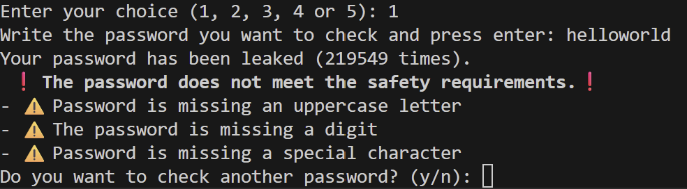
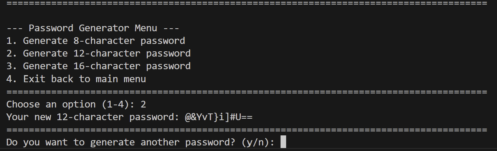
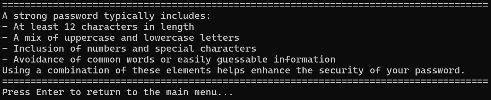
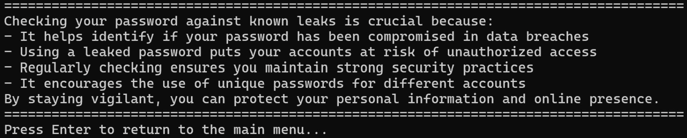

  

# PassLeakPeek – Password Leak & Strength Analyzer

PassLeakPeek is a lightweight security tool designed to help users verify whether their passwords have appeared in known data breaches. It integrates with the Have I Been Pwned API using secure k-anonymous hashing, evaluates password strength, and logs masked password entries for safe auditing.

## Purpose and Goals

PassLeakPeek aims to:

- Provide a safe and privacy-preserving way to check if a password has been leaked.
- Help users understand the security level of their passwords through validation rules.
- Log password checks without ever storing the real password, using randomized masking.
- Offer a simple, menu-driven interface suitable for both beginners and technical users.
- Serve as an educational tool for understanding password security and helps users create new safer passwords.
- Created to assist individuals of all ages who may not be aware of modern password security standards.

## Functionality

### Password Leak Check
- Converts the user’s password into a SHA-1 hash.
- Sends only the first 5 characters of the hash to the Have I Been Pwned API.
- Compares the returned hash suffixes to determine if the password has been leaked.
- Displays how many times the password appears in breach datasets.

### Password Strength Validation
- Evaluates password complexity (length, symbols, numbers, uppercase/lowercase).
- Provides feedback to help users improve weak passwords.

### Password Generation
- Generates strong, randomized passwords using uppercase/lowercase letters, numbers, and special characters.
- Designed to be simple and and user friendly.
- Helps users create secure passwords before checking them for known breaches.

### Educational information about secure password
- Tells the user what a strong password is and why its strong.

- Tells the user why they shoudk use a strong password.

### Secure Logging
- Saves masked versions of tested passwords to `PasswordLeaked.txt`.
- Masking uses:
  - First character
  - Random number of asterisks (*)
  - Last character
- Prevents revealing password length or structure.
- Writes a header only the first time the file is created.

### Interactive Menu
- Allows repeated password checks without restarting the program.
- Clean, user-friendly CLI workflow.

## System Requirements

To run PassLeakPeek, you need:

- Python 3.10 or later
- Internet connection (for API requests)
- Operating system:
  - Windows
  - macOS

### Required Python Packages

Install dependencies with:
pip install requests

## Instructions

### 1. Clone the repository

git clone https://github.com/Kim-projects97/PassLeak-Peek
cd PassLeak-Peek

### 2. Install dependencies

pip install requests  (or pip3 install requests if needed)

### 3. Run the program

python PassLeakPeek.py

### 4. Follow the menu prompts

You will be able to:

- Enter a password to check
- View leak results
- See password strength feedback
- Automatically log masked passwords

### 5. View logs (optional)

Open the file:

PasswordLeaked.txt

This file contains masked password entries and leak counts.

