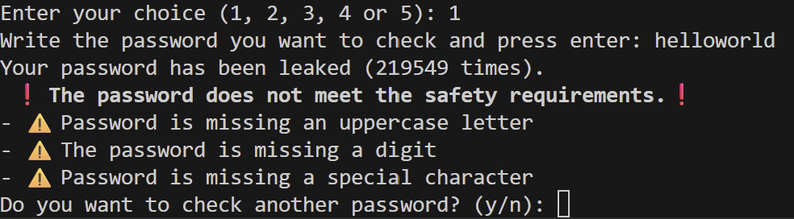
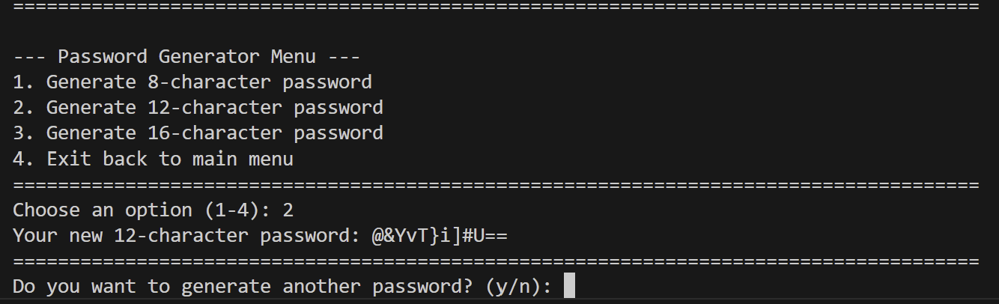
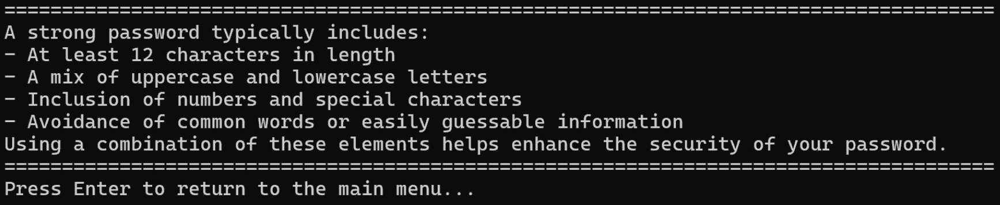
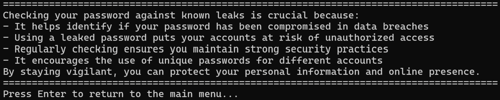
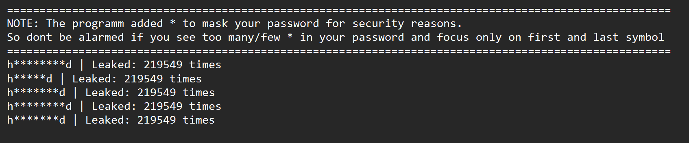

  

##  Table of Contents

- [PassLeakPeek – Password Leak & Strength Analyzer](#passleakpeek--password-leak--strength-analyzer)
- [Functionality](#functionality)
- [System Requirements](#system-requirements)
- [Roadmap](#%EF%B8%8F-roadmap)
- [Instructions](#instructions)

# PassLeakPeek – Password Leak & Strength Analyzer

PassLeakPeek is a lightweight security tool designed to help users verify whether their passwords have appeared in known data breaches. It integrates with the Have I Been Pwned API using secure k-anonymous hashing, evaluates password strength, and logs masked password entries for safe auditing.

## Purpose and Goals

PassLeakPeek aims to:

- Provide a safe and privacy-preserving way to check if a password has been leaked.
- Help users understand the security level of their passwords through validation rules.
- Log password checks without ever storing the real password, using randomized masking.
- Offer a simple, menu-driven interface suitable for both beginners and technical users.
- Serve as an educational tool for understanding password security and helps users create new safer passwords.
- Created to assist individuals of all ages who may not be aware of modern password security standards.

## Functionality

### Password Leak Check
- Converts the user’s password into a SHA-1 hash.
- Sends only the first 5 characters of the hash to the Have I Been Pwned API.
- Compares the returned hash suffixes to determine if the password has been leaked.
- Displays how many times the password appears in breach datasets.

### Password Strength Validation
- Evaluates password complexity (length, symbols, numbers, uppercase/lowercase).
- Provides feedback to help users improve weak passwords.

### Password Generation
- Generates strong, randomized passwords using uppercase/lowercase letters, numbers, and special characters.
- Designed to be simple and and user friendly.
- Helps users create secure passwords before checking them for known breaches.

### Educational information about secure password
- Tells the user what a strong password is and why its strong.

- Tells the user why they shoudk use a strong password.

### Secure Logging
This file will be found in the same folder as the program after you have run the program for the first time.
- Saves masked versions of tested passwords to `PasswordLeaked.txt`.
- Masking uses:
  - First character
  - Random number of asterisks (*)
  - Last character
- Prevents revealing password length or structure.
- Writes a header only the first time the file is created.
- Records the current date and time for each password check
- In this example I typed in ''helloworld'' five times and got diffrent lenght.

### Interactive Menu
- Allows repeated password checks without restarting the program.
- Clean, user-friendly CLI workflow.

<h2>CLI Flags Overview</h2>
<table>
  <thead>
    <tr>
      <th>Flag</th>
      <th>Status</th>
      <th>Function</th>
    </tr>
  </thead>
  <tbody>
    <tr>
      <td><code>-v / --version</code></td>
      <td>Metadata</td>
      <td>Displays program version and developer info</td>
    </tr>
    <tr>
      <td><code>-h / --help</code></td>
      <td>Support</td>
      <td>Shows help text and usage examples</td>
    </tr>
    <tr>
      <td><code>-c / --check</code></td>
      <td>Password Validation</td>
      <td>Checks a password directly via CLI</td>
    </tr>
    <tr>
      <td><code>-g / --generate</code></td>
      <td>Password Generation</td>
      <td>Generates a strong password of specified length</td>
    </tr>
    <tr>
      <td><code>-clear / --clear</code></td>
      <td>File Management</td>
      <td>Clears the <code>PasswordLeaked.txt</code> file</td>
    </tr>
  </tbody>
</table>

## System Requirements

To run PassLeakPeek, you need:

- Python 3.10 or later
- Internet connection (for API requests)
- Operating system:
  - Windows
  - macOS

### Required Python Packages

Install dependencies with:
pip install requests

<h2>Roadmap</h2>

<table>
  <thead>
    <tr>
      <th style="text-align:left">Version</th>
      <th style="text-align:left">Status</th>
      <th style="text-align:left">Focus</th>
      <th style="text-align:left">Key Features</th>
    </tr>
  </thead>
  <tbody>
    <tr>
      <td><strong>v1.0.10</strong></td>
      <td>✅ Completed</td>
      <td>Core Functionality</td>
      <td>
        • CLI interface with menu and flags 
        • Password generation with length validation 
        • API integration with PwnedPasswords 
        • Hashing and leak detection 
        • Save and clear leaked password file
      </td>
    </tr>
        <tr>
      <td><strong>v2.0.0</strong></td>
      <td>🧠 Planned short-term</td>
      <td>Availability</td>
      <td>
        • Add Swedish langugue
      </td>
    </tr>
    <tr>
      <td><strong>v2.0.0</strong></td>
      <td>🧠 Planned long-term</td>
      <td>Proactive Monitoring</td>
      <td>
        • Background execution with user-defined password list 
        • Email alerts on detected leaks 
        • Partial match detection (e.g. "helloworld") 
        • Support for additional leak sources (RockYou, breach archives)
      </td>
    </tr>
  </tbody>
</table>

## Instructions

### 1. Clone the repository

git clone https://github.com/Kim-projects97/PassLeak-Peek
cd PassLeak-Peek

### 2. Install dependencies

pip install requests  (or pip3 install requests if needed)

### 3. Run the program

python PassLeakPeek.py

### 4. Follow the menu prompts

You will be able to:

- Enter a password to check
- View leak results
- See password strength feedback
- Automatically log masked passwords

### 5. View logs (optional)

Open the file:

PasswordLeaked.txt

This file contains masked password entries and leak counts.

